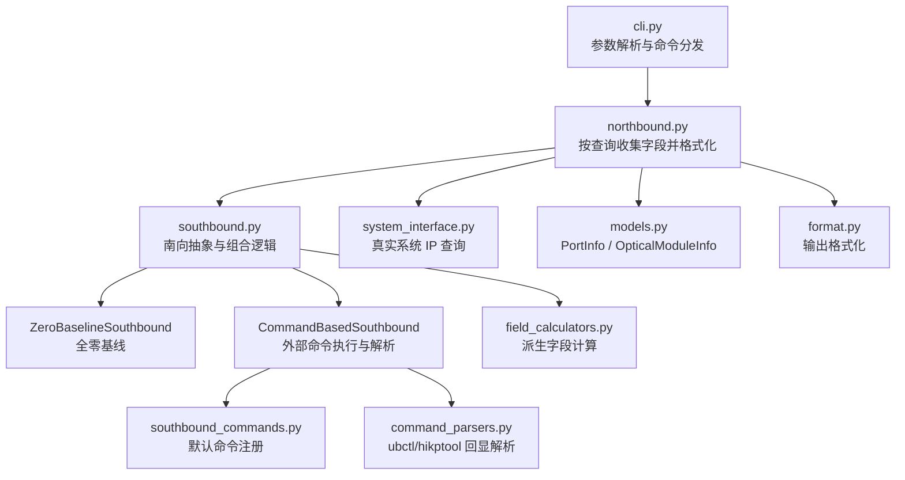

# otpd — 光模块脏污检测

`otpd` 是 UBLink-DT 的光模块脏污检测模块，运行在 OpenEuler 环境上。它通过 `ublinkdt -m otpd` 提供命令行入口，按查询类型即时执行南向采集命令，并将结果格式化输出。

## 快速开始

### 1. 安装交付版本

需要 Python 3.7 或更高版本。交付版本运行时仅依赖 Python 标准库。

```bash
python -m pip install -e .
```

### 2. 运行查询

所有查询都需要 `-p` 和 `-c`。`--stat`、`--link-stat` 还需要 `-d 0/1`；`--port-snr` 会忽略 `-d`；`--optical` 固定使用 die 3，即使传入 `-d` 也会忽略该输入。

```bash
ublinkdt -m otpd -p 0 -c 0 --port-snr
ublinkdt -m otpd -p 0 -c 0 -d 0 --stat
ublinkdt -m otpd -p 0 -c 0 --optical
ublinkdt -m otpd -p 0 -c 0 --ip --inet6
ublinkdt -m otpd -p 0 -c 0 -d 0 --link-stat
```

`--ip` 目前只支持 IPv6 查询，必须同时传入 `--inet6`。

## 环境与依赖

| 场景 | 命令 | 说明 |
| --- | --- | --- |
| 交付/运行 | `python -m pip install -e .` | 不安装测试依赖；依赖`ubctl`、`hikptool` |
| 构建 wheel | `python -m pip install -r requirements.txt` | 只安装 `build`、`setuptools`、`wheel` |
| Debug 运行 | 见“Debug 桩模式” | 构建并安装会响应 `OTPD_STUB_MODE` 的 Debug wheel |

设备侧查询依赖目标环境提供对应系统命令：

| 查询 | 外部命令/来源 |
| --- | --- |
| `--port-snr` | `hikptool serdes_info` |
| `--stat` | `ubctl -m port_info`、`ubctl -m dl -f bit_err` |
| `--optical` | `hikptool optical_dom` |
| `--link-stat` | `ubctl -m port_link` |
| `--ip --inet6` | Linux `ip -6 addr show`；Windows `ipconfig` / PowerShell |

## 构建 Wheel

构建交付 wheel：

```bash
python -m pip install -r requirements.txt
python -m build --wheel --no-isolation
python -m pip install dist/ublinkdt-1.0.0-py3-none-any.whl
```

构建 Debug wheel：

```bash
python -m pip install -r requirements.txt
python -m build --wheel --no-isolation -C--build-option=--debug-build
python -m pip install dist/ublinkdt-1.0.0-py3-none-any.whl
```

Debug wheel 会在构建产物中写入 Debug 标记。交付 wheel 会忽略 `OTPD_STUB_MODE`。

默认 `python -m build` 会创建隔离构建环境，并在该环境中安装构建依赖。内网或离线环境推荐使用上面的 `--no-isolation`，让构建过程复用当前环境中已经安装好的 `requirements.txt`。

## Debug 桩模式

> 此模式仅用于集成联调，不得在生产环境中启用。

Debug 桩模式需要先构建并安装 Debug wheel，再设置 `OTPD_STUB_MODE=1`。普通源码运行或 `python -m pip install -e .` 安装仍是交付模式，即使设置 `OTPD_STUB_MODE=1` 也会继续执行真实南向命令。

```bash
python -m pip install -r requirements.txt
python -m build --wheel --no-isolation -C--build-option=--debug-build
python -m pip install --force-reinstall dist/ublinkdt-1.0.0-py3-none-any.whl
OTPD_STUB_MODE=1 ublinkdt -m otpd -p 0 -c 0 -d 0 --stat
```

| 行为 | Debug 构建桩模式（`OTPD_STUB_MODE=1`） | 交付模式（默认） |
| --- | --- | --- |
| 命令可执行文件不存在 | 返回零值占位，记录 warning | 记录详细 warning 后抛出 `FileNotFoundError`，CLI 报错退出 |
| 所有绑定命令返回空数据 | 零值覆盖相关字段，返回数据 | 返回 `None`，CLI 报错退出 |
| 部分命令返回空数据 | 缺失字段置零，返回数据 | 缺失字段置零，记录详细 warning |

桩模式下返回的零值与真实零值无法区分，例如温度或误码数恰好为 0 时，无法判断是真实读数还是占位值。

## 当前命令接入进展

默认南向源由 `build_hybrid_southbound()` 构造：先生成全零基线，再执行已注册的真实命令覆盖对应字段。

| CLI | 当前状态 | 默认命令/来源 | 说明 |
| --- | --- | --- | --- |
| `--port-snr` | 已接入 | `hikptool serdes_info -i {chip_id} -s m{port_id+10}d0 -n 4 -k` | 固定输出 4 个 port SNR lane |
| `--stat` | 已逐步接入 | `ubctl -m port_info`、`ubctl -m dl -f bit_err` | 解析纠前误码数、不可纠误码数等指标 |
| `--optical` | 已逐步接入 | `hikptool optical_dom` | 解析 SN、厂商、温度、电压、功率、偏置电流、Host/Media SNR、失锁标志 等字段 |
| `--link-stat` | 已逐步接入 | `ubctl -m port_link` | 解析建链、断链记录 |
| `--ip --inet6` | 已接入系统命令 | 过滤无用地址后返回第一条 IPv6 地址 |

数据缺失规则：

1. 查询所需字段没有绑定任何启用命令时，返回全零基线。
2. 查询所需字段已经绑定命令，但执行或解析后没有拿到数据时，记录 warning，并且该查询返回失败。
3. 多个命令中有部分成功时，成功字段覆盖基线；属于已执行命令覆盖范围但缺失的字段置零。
4. 交付模式下，命令可执行文件不存在时抛出 `FileNotFoundError`；Debug 桩模式下返回占位数据。

## 架构



核心数据流：

1. `cli.py` 校验 `-m otpd`、`-p/-c`、查询选项；`--stat`、`--link-stat` 校验 `-d 0/1`，`--optical` 固定使用 die 3，`--port-snr` 忽略 `-d`。
2. `northbound.py` 根据查询类型传入 `required_fields`，声明本次查询所需字段，避免执行无关命令。
3. `CompositeSouthbound` 判断是否有相关命令绑定。
4. 未绑定时直接使用 `ZeroBaselineSouthbound`；已绑定时执行 `CommandBasedSouthbound`。
5. parser 返回字段字典，组合层覆盖零基线并运行派生字段计算。
6. 北向层格式化为 CLI 输出。

`required_fields` 是南向接口的正式参数。缓存会区分全量查询和不同字段集合的局部查询，避免一次局部采集结果被误用于另一类查询。

## 主要模块

| 文件 | 作用 |
| --- | --- |
| `src/otpd/cli.py` | CLI 参数解析、校验、命令执行 |
| `src/otpd/northbound.py` | 北向业务逻辑；按查询请求所需字段 |
| `src/otpd/southbound.py` | `ZeroBaselineSouthbound`、`CommandBasedSouthbound`、`CompositeSouthbound` |
| `src/otpd/southbound_commands.py` | 默认 `ubctl` / `hikptool` 命令注册 |
| `src/otpd/command_parsers.py` | 南向命令文本回显解析 |
| `src/otpd/field_calculators.py` | `cw_total_cnt` 等派生字段计算 |
| `src/otpd/system_interface.py` | `RealSystemInterface`，跨平台 IP 查询 |
| `src/otpd/models.py` | `PortInfo`、`OpticalModuleInfo` 数据模型 |
| `src/otpd/format.py` | CLI 输出格式化；按 `lane_count` 显示逐 lane 明细 |

## 南向命令开发

默认命令在 `src/otpd/southbound_commands.py` 中注册。新增命令时需要提供：

1. `CommandEntry.name`
2. 命令模板，支持 `{port_id}`、`{chip_id}`、`{die_id}`，以及类似 `{port_id+10}` 的简单整数偏移
3. parser 函数
4. `fields`，声明该命令覆盖哪些模型字段

示例：

```python
from src.otpd.southbound import CommandEntry

def parse_snr(stdout: str) -> dict:
    return {"port_snrlane": [25.0, 25.1, 25.2, 25.3]}

entry = CommandEntry(
    name="vendor_port_snr",
    command=["vendor-tool", "snr", "-c", "{chip_id}", "-p", "{port_id}"],
    parser=parse_snr,
    fields=["port_snrlane"],
)
```

更完整的 parser 约定、错误处理和默认命令映射见：

- [南向命令开发指南](southbound_command_guide.md)
- [南向命令映射](southbound_command_mapping.md)

## 注意事项

| 项目 | 当前行为 |
| --- | --- |
| `cw_total_cnt` | 按 `sds_rate_bps * collection_window * tx_lane_num` 计算；缺少任一输入字段时记录 warning，并输出 0 |
| 光模块 lane count | 只使用 `hikptool optical_dom` 的 `Host Lane Count` 回显；若缺少该回显，逐 lane 功率/SNR/偏置明细不显示 |

## 测试

```bash
python -m pip install pytest pytest-cov
pytest
pytest tests/otpd/ -v
```

| 测试文件 | 覆盖模块 |
| --- | --- |
| `tests/otpd/test_cli.py` | CLI 参数解析与命令执行 |
| `tests/otpd/test_models.py` | 数据模型 |
| `tests/otpd/test_northbound.py` | 北向格式化和查询路由 |
| `tests/otpd/test_southbound.py` | 零基线、命令源、组合南向、parser 和失败语义 |
| `tests/otpd/test_system_interface.py` | 真实系统接口的 Linux/Windows IP 解析 |
| `tests/otpd/test_utils.py` | 输出格式化 |
| `tests/otpd/test_removed_background_api.py` | 已移除后台采集 API 的回归测试 |
